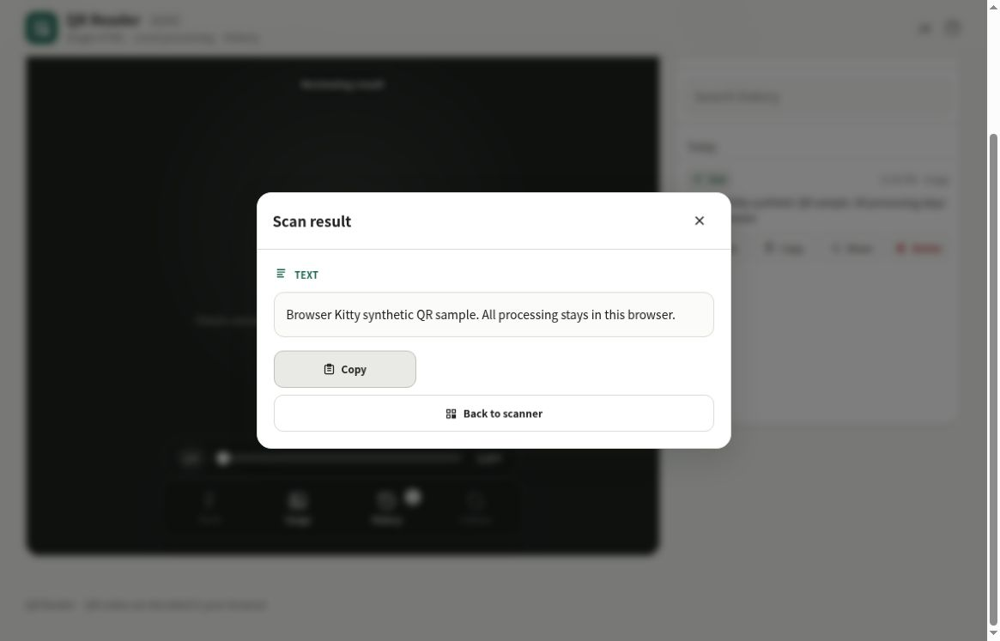

# QR Reader

[](https://github.com/ttomohisa/htmlapps-qr-reader/actions/workflows/deploy-pages.yml)
[](LICENSE)
[](https://ttomohisa.github.io/htmlapps-qr-reader/)

[日本語版 README](README.ja.md)

A smartphone-first, privacy-focused QR code reader that runs entirely in the browser and is distributed as a single self-contained HTML file.

## 🚀 Live demo

### [Open QR Reader on GitHub Pages](https://ttomohisa.github.io/htmlapps-qr-reader/)

GitHub Pages only delivers the initial HTML. Camera frames, selected images, QR decoding, result classification, and scan history are processed locally on your device. The app does not upload scanned content or selected images to a server.

[](https://ttomohisa.github.io/htmlapps-qr-reader/)

## Features

- Starts the rear camera automatically on launch
- Continuously scans QR codes from the live camera preview
- Reads QR codes from screenshots and existing image files
- Accepts a copied image pasted onto the scanner (Ctrl+V / Cmd+V when the browser provides image data)
- Uses the browser's native `BarcodeDetector` when available, with embedded `jsQR` as a fallback
- Torch control when exposed by the active camera and browser
- Optical camera zoom when available, with digital zoom fallback
- Zoom with a slider, vertical swipe, or pinch gesture
- Switch between available cameras
- Smartphone-first full-screen camera UI with safe-area support
- Result sheet with icons and actions for opening, copying, and sharing
- Recognizes URL, email, phone, SMS, geo, Wi-Fi, vCard, and plain text payloads
- Never opens URLs automatically; the decoded value is shown first
- Local scan history with search and up to 200 entries
- Open, copy, share, or delete directly from each history item
- Custom confirmation dialogs for individual deletion and clearing all history
- Japanese and English UI in the same HTML
- Embedded SVG favicon
- No runtime network access in the built artifact

## Quick start

### Use the web demo

Just [open the demo](https://ttomohisa.github.io/htmlapps-qr-reader/). No installation or account is required.

Camera access generally requires a secure context, so GitHub Pages or another HTTPS host is the recommended way to use live scanning on a smartphone.

### Use the standalone HTML

1. Download or clone this repository.
2. Run `build-standalone.bat` on Windows.
3. Open the generated `dist/index.html`.

Image-based QR scanning works directly from the standalone file. Depending on the browser, live camera access may be unavailable from a `file://` URL because `getUserMedia()` usually requires HTTPS or `localhost`.

### Build it fully self-contained

1. Download or clone this repository.
2. Double-click `build-standalone.bat` on Windows 10/11.
3. The first build downloads the exact `jsqr@1.4.0` package pinned in `dependencies.json`.
4. The build embeds the decoder into `dist/index.html`.
5. Later builds reuse the local `.cache` unless `-ForceDownload` is specified.

Python, Node.js, and a local web server are not required. The builder uses Windows PowerShell and the built-in `tar.exe`.

## Usage

Use **EN / JA** in the header to switch languages. Language, Help, and Close tooltips and accessible labels follow the selected language.

1. Open the app and allow camera access.
2. Point the rear camera at a QR code. Detection runs automatically.
3. Review the decoded value in the result sheet.
4. Use **Open**, **Copy**, or **Share** as needed.
5. Use **Image** to scan a screenshot or saved photo, or paste a copied image onto the scanner with **Ctrl+V / Cmd+V**.
6. Open **History** to revisit previously scanned values.

### Pasting an image

Paste on the scanner when no dialog or text field is active. The app decodes only the first usable image supplied by that paste event, using the same local decoder as image import. It does not read clipboard text, fetch pasted URLs, or request clipboard access. Browsers that do not provide an image file for paste can still use **Image**.

Only one image is processed at a time. Close the result before pasting another image. Repeating the same image immediately still shows its result; consecutive identical results within four seconds share one history entry. The camera retains its 1.8-second duplicate cooldown.

### Camera controls

- **Torch** — toggles the camera light when supported.
- **Image** — selects an existing image or screenshot.
- **History** — opens the locally stored scan history.
- **Camera** — switches between available cameras.
- **Zoom slider** — adjusts zoom precisely.
- **Vertical swipe** — swipe up or down on the camera preview to zoom.
- **Pinch** — pinch with two fingers to zoom.

Torch and optical zoom availability depends on the device, camera, and browser. When optical zoom is unavailable, the app falls back to digital zoom.

### Scan history

History is stored in `localStorage` and is never uploaded by the app.

- Up to 200 scan results are retained.
- Results are grouped by date.
- Long values are truncated in the list so URLs remain readable.
- Each item provides **Open**, **Copy**, **Share**, and **Delete** actions.
- Individual deletion and **Clear all history** use custom in-app confirmation dialogs.
- Clearing browser site data also removes the history.

## Publish with GitHub Pages

The repository includes a workflow that builds the fully embedded HTML and deploys it to GitHub Pages automatically.

1. Push the repository to GitHub as `htmlapps-qr-reader`.
2. Open **Settings → Pages → Build and deployment → Source** and select **GitHub Actions**.
3. Push to `main`, or manually run **Deploy QR Reader to GitHub Pages** from the Actions tab.
4. After a successful deployment, the demo is available at `https://ttomohisa.github.io/htmlapps-qr-reader/`.

Each push to `main` rebuilds `dist/index.html` from the pinned dependency, verifies that no external runtime script references or unresolved build placeholders remain, and then publishes the result.

## Development and build layout

```text
.
├─ src/index.template.html       # Application template
├─ dependencies.json             # Pinned npm dependency and embedded assets
├─ app.config.json               # Application metadata and build settings
├─ build-standalone.bat          # Windows build entry point
├─ build-standalone.ps1          # Single-HTML builder
├─ scripts/
│  ├─ check-repository.ps1       # Repository/build validation
│  └─ verify-standalone.ps1      # Generated HTML verification
├─ dist/index.html               # Generated deployment artifact
└─ .github/workflows/
   └─ deploy-pages.yml           # Automatic GitHub Pages deployment
```

### Update dependencies

Edit the pinned package version or embedded asset path in `dependencies.json`, then run `build-standalone.bat` again.

To discard the package cache and download the dependency again:

```bat
build-standalone.bat -ForceDownload
```

The build process automatically:

- Downloads the pinned npm tarball from the official npm registry
- Embeds `jsQR` directly into the generated HTML
- Records SHA-256 hashes in `dist/dependency-manifest.json`
- Rejects unresolved build placeholders
- Rejects external runtime script, stylesheet, frame, CSS URL, and module references
- Verifies that `connect-src 'none'` remains in the Content Security Policy
- Generates `dist/.nojekyll` for GitHub Pages

## Privacy and runtime network protection

The generated HTML includes a Content Security Policy with `connect-src 'none'`. Camera frames, selected images, decoded QR values, and history remain inside the browser.

The GitHub Pages version requires the initial HTML request, but the app does not send scanned QR data, images, or camera frames to an external service. The embedded QR decoder also runs locally.

For image-only use with the network completely disconnected, open the generated `dist/index.html` locally.

## Browser notes and limitations

- Live camera access depends on `getUserMedia()` support and browser permission.
- Camera access generally requires HTTPS or `localhost`; `file://` pages may not receive camera permission.
- Torch, optical zoom, and camera switching depend on capabilities exposed by the device and browser.
- The Web Share API is not available in every browser; the Share button is hidden when unsupported.
- Very small, blurred, low-contrast, or reflective QR codes can be harder to detect.
- Browser storage can be cleared by the user, the browser, or private-browsing policies, which removes scan history.

## Dependencies

| Library | Version | License | Purpose |
| --- | ---: | --- | --- |
| jsQR | 1.4.0 | Apache-2.0 | QR decoding fallback for camera frames and images |

When supported, the app also uses the browser-native `BarcodeDetector` API without adding another dependency. See [THIRD_PARTY_NOTICES.md](THIRD_PARTY_NOTICES.md) for third-party notices.

## License

Copyright © 2026 ttomohisa

Licensed under the [MIT License](LICENSE).

### Automated regression checks

With Node.js 22 or later and PowerShell available, run `scripts/check-repository.ps1`. It builds the standalone artifact and runs the Node tests against the source template, checked-in `qr-reader.html`, and generated `dist/index.html`. Regenerate the checked-in HTML after source edits with `./build-standalone.ps1 -OutputPath qr-reader.html`. A normal standalone build does not require Node.js.

The tests decode synthetic QR matrices with the actual embedded jsQR 1.4.0 and check image paste, repeated imports, concurrency, cleanup, history, and URL safety. DOM, canvas, image-codec, and camera boundaries are simulated; physical Android/iOS camera, clipboard, and layout checks are still required for browser-level validation.
